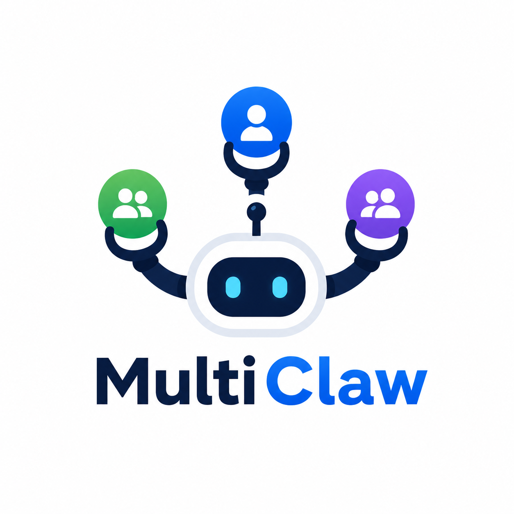
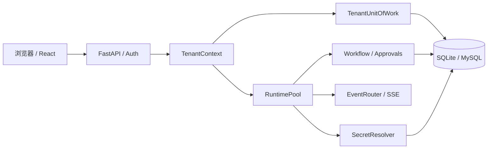

# MultiClaw



MultiClaw 是一个面向单机部署的多租户 AI Agent 运行时，提供工具调用、MCP、可恢复工作流、租户级 Secret 和 Web 管理界面。

> **项目状态：** 当前版本为 `0.1.0`，仍处于开发阶段，尚未正式发布。API、配置和数据模型可能在后续版本中调整，请勿把当前版本直接用于关键生产负载。

## 核心能力

- 运行 Agent、内置工具和 MCP 工具，并按策略处理高风险操作审批。
- 通过 `tenant_id`、`workspace_id`、`session_id` 和 `run_id` 对持久化数据、运行时与事件流实施作用域隔离。
- 使用租约、fencing token、CAS、检查点和恢复服务持久化工作流状态。
- 以 AES-256-GCM envelope 加密租户自带的模型与集成凭据；API 不返回明文 Secret。
- 在 macOS Seatbelt 或 Linux nsjail 中运行受限 shell、代码执行和本地 stdio MCP 进程。
- 通过同一套 SQLAlchemy/Alembic 边界支持 SQLite 与 MySQL。

## 支持范围

| 项目 | 当前支持范围 |
|---|---|
| Python | `>=3.12` |
| Node.js | CI 使用 Node.js 22；前端开发建议保持一致 |
| 数据库 | SQLite；MySQL Community 8，最低 `8.0.36` |
| macOS 沙箱 | Seatbelt（`sandbox-exec`） |
| Linux 沙箱 | nsjail，需部署方安装并配置 |
| 部署拓扑 | 单进程、单机 `standalone`；不支持多副本集群 |

## 快速开始

以下命令在仓库根目录执行，使用一个全新的显式 SQLite 文件，避免误用旧开发数据库。

### 1. 安装依赖

```bash
uv sync
cd frontend
npm ci
cd ..
```

### 2. 创建仅供当前终端使用的开发密钥

```bash
export MULTICLAW_AUTH_JWT_SIGNING_KEY="$(uv run python -c 'import secrets; print(secrets.token_urlsafe(48))')"
export MULTICLAW_SECRETS_KEYRING_B64="$(uv run python -c 'import base64,json,secrets; payload={"active_key_version":1,"keys":{"1":base64.b64encode(secrets.token_bytes(32)).decode()}}; print(base64.b64encode(json.dumps(payload).encode()).decode())')"
export MULTICLAW_EMAIL__PROVIDER=brevo
export MULTICLAW_BREVO__MOCK=true
```

这些值只存在于当前 shell。mock 邮件模式只跳过邮件发送，不会在接口或页面显示验证码，因此可以验证启动和健康状态，但不能完成交互式登录。需要登录时，请按[配置参考](docs/configuration.md#邮件提供商emailbrevoresend)配置真实 Brevo 或 Resend 提供商。

> 生产环境必须从受控环境变量或权限为 `0600` 的文件注入稳定密钥；不要在每次启动时重新生成，不要提交到 Git，也不要同时配置同一密钥的环境变量与文件来源。

### 3. 初始化 SQLite

```bash
mkdir -p data
export MULTICLAW_DATABASE__DRIVER=sqlite
export MULTICLAW_DATABASE__URL=sqlite+aiosqlite:///data/multiclaw-dev.db
uv run multiclaw db upgrade
uv run multiclaw db check
```

`db upgrade` 显式迁移到 Alembic `head`，`db check` 确认数据库 revision 与代码一致。应用启动不会自动替你迁移数据库。

### 4. 启动后端和前端

终端一：

```bash
uv run uvicorn multiclaw.server:app --host 127.0.0.1 --port 15800 --reload
```

终端二：

```bash
cd frontend
npm run dev
```

常用入口：

- Web 界面：<http://127.0.0.1:5173>
- 后端：<http://127.0.0.1:15800>
- OpenAPI UI：<http://127.0.0.1:15800/docs>
- 存活检查：<http://127.0.0.1:15800/api/health/live>
- 就绪检查：<http://127.0.0.1:15800/api/health/ready>

也可以运行 `./start.sh`，但它只是 macOS 风格的开发便利脚本：会终止占用 `15800`/`5173` 的现有进程、把两个服务绑定到 `0.0.0.0`、尝试打开浏览器并持续跟踪后端日志。它不是生产服务管理器；多人共享主机或端口上已有重要进程时不要使用。

更完整的首次启动、真实邮件配置和停止步骤见[入门指南](docs/getting-started.md)。

## 架构概览



认证成功后，服务端从用户的默认工作区构造租户上下文；仓储、运行时、工作流和事件订阅都使用该上下文缩小作用域。完整的不变量、故障恢复和数据生命周期见[架构说明](docs/architecture.md)。

## 文档导航

| 主题 | 文档 |
|---|---|
| 首次启动 | [入门指南](docs/getting-started.md) |
| 架构与模块 | [架构说明](docs/architecture.md) |
| 配置与密钥 | [配置参考](docs/configuration.md) |
| 开发流程 | [开发指南](docs/development.md) |
| HTTP / SSE | [API 概览](docs/api.md) |
| 测试矩阵 | [测试指南](docs/testing.md) |
| 安全边界 | [安全模型](docs/security-model.md) |
| 部署与运维 | [部署指南](docs/deployment.md) · [多租户运维](docs/multi-tenant-operations.md) |
| 问题定位 | [故障排查](docs/troubleshooting.md) |
| 全部文档 | [文档索引](docs/README.md) |

## 验证

```bash
uv run python scripts/check_docs.py
uv run pytest -q
cd frontend
npm run lint
npm run build
```

MySQL、原生沙箱和前端浏览器验证需要额外环境，具体门禁和跳过语义见[测试指南](docs/testing.md)。

## 参与贡献

提交改动前请阅读 [CONTRIBUTING.md](CONTRIBUTING.md)。它说明了分支、提交、Lore trailer、测试证据和 Pull Request 要求。

## 安全

公开问题不得包含未披露漏洞或凭据。安全报告流程见 [SECURITY.md](SECURITY.md)，实现侧信任边界见[安全模型](docs/security-model.md)。

## 许可证

本项目采用 [Apache License 2.0](LICENSE)。

## 当前限制

- 仅支持单机 `standalone`，不提供跨进程运行时协调、集群 leader election 或共享 SSE 总线。
- 每个用户当前绑定一个默认工作区，不提供工作区切换或平台超级管理员能力。
- 单个 run 内的工具执行保持串行；只读工具的并行调度属于受限选项。
- Secret 使用部署 keyring，不集成 KMS、Vault 或平台托管密钥服务。
- Linux 原生沙箱需要部署方提供 nsjail；开发不安全模式不能视为生产替代方案。

