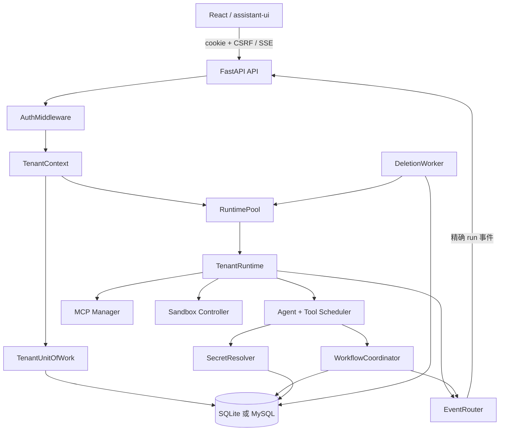
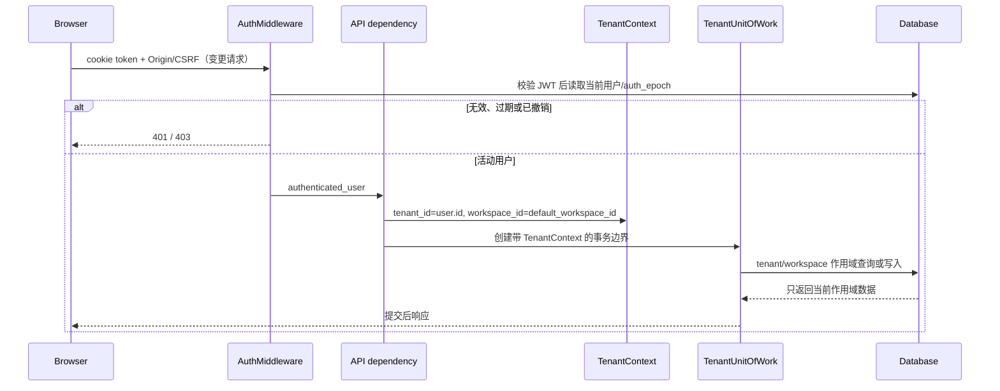

# 架构说明

## 范围与非目标

MultiClaw `0.1.0` 是单进程、单机 `standalone` Agent 运行时。它在一个 FastAPI 进程内管理多个租户的持久化状态和按需运行时，并以 React 前端提供交互界面。

当前架构不支持多副本集群、跨进程运行时协调、共享事件总线、平台超级管理员、一个用户切换多个工作区、KMS/Vault 或数据库双写。SQLite 与 MySQL 是二选一的部署后端，不是同时写入的两份数据。

## 仓库与模块

| 边界 | 生产模块 | 职责 |
|---|---|---|
| 服务生命周期 | [`server.py`](../src/multiclaw/server.py) | 组装 Settings、数据库、认证、keyring、运行时池、后台 worker 与路由 |
| HTTP API | [`api/`](../src/multiclaw/api/) · [`auth/router.py`](../src/multiclaw/auth/router.py) | 认证、会话、聊天、审批、Secret、账号删除和健康检查 |
| 租户上下文 | [`tenancy/context.py`](../src/multiclaw/tenancy/context.py) | 承载 tenant/workspace/session/run 标识并进行逐级收窄 |
| 持久化边界 | [`storage/uow.py`](../src/multiclaw/storage/uow.py) · [`storage/repositories/`](../src/multiclaw/storage/repositories/) | 事务、租户作用域查询与写入 |
| 数据库方言 | [`storage/engine.py`](../src/multiclaw/storage/engine.py) · [`storage/dialect.py`](../src/multiclaw/storage/dialect.py) | SQLite/MySQL 连接、锁与方言差异 |
| 租户运行时 | [`runtime/factory.py`](../src/multiclaw/runtime/factory.py) · [`runtime/pool.py`](../src/multiclaw/runtime/pool.py) | 按租户创建、复用、限容、撤销和回收运行时 |
| 工作流 | [`workflow/coordinator.py`](../src/multiclaw/workflow/coordinator.py) · [`workflow/recovery.py`](../src/multiclaw/workflow/recovery.py) | run 租约、fencing、检查点、审批、恢复与终态 |
| 事件 | [`events/router.py`](../src/multiclaw/events/router.py) · [`stream.py`](../src/multiclaw/stream.py) | 精确作用域事件投递与 SSE 编码 |
| Secret | [`secrets/envelope.py`](../src/multiclaw/secrets/envelope.py) · [`secrets/resolver.py`](../src/multiclaw/secrets/resolver.py) | 租户 Secret 加密、解密、回退和内存清零 |
| 工具治理 | [`tools/scheduler.py`](../src/multiclaw/tools/scheduler.py) · [`governance/`](../src/multiclaw/governance/) | 工具调度、审批、审计与原生沙箱 |
| 删除生命周期 | [`deletion/service.py`](../src/multiclaw/deletion/service.py) · [`deletion/worker.py`](../src/multiclaw/deletion/worker.py) | 延迟删除、恢复窗口和最终清除 |
| Web 界面 | [`frontend/src/`](../frontend/src/) | 认证、会话、聊天流、审批、Secret 与删除恢复 |

## 组件关系



`TenantContext` 是贯穿 API、仓储、运行时、工作流和事件的身份载体。仅知道一个资源 ID 不足以访问资源；仓储查询还必须匹配上下文中的租户和工作区，run 资源继续匹配 session 与 run。

## 认证请求链路



具体实现：

1. [`AuthMiddleware`](../src/multiclaw/auth/middleware.py) 校验 HttpOnly `token` cookie、JWT audience、`auth_epoch` 与用户状态；所有非安全方法还必须通过 Origin/Referer 和双提交 CSRF 校验。
2. [`tenant_context`](../src/multiclaw/api/dependencies.py) 只接受活动用户及其有效默认工作区，构造 `TenantContext(tenant_id=user.id, workspace_id=...)`。
3. [`TenantUnitOfWork`](../src/multiclaw/storage/uow.py) 把上下文传给 sessions、memory、workflow 和 secrets 仓储；事务结束时提交，异常时回滚。
4. 仓储层将作用域列写入查询条件和外键关系。对外通常以 `404` 隐藏跨租户资源是否存在。

## RuntimePool 生命周期

[`RuntimePool`](../src/multiclaw/runtime/pool.py) 以 `tenant_id` 作为内存身份，一个租户在一个进程中最多有一个 resident `TenantRuntime`。同租户创建由 per-tenant lock 串行化，容量检查由独立锁保护。

- `max_resident_tenants` 限制 resident 数量；容量满时先尝试回收安全的 idle runtime，否则返回带 `Retry-After` 的 `503`。
- 每次 acquire 会刷新 `last_used_at_ms`。超过 `idle_ttl_seconds` 只是候选条件，不会强制终止活跃执行。
- 无活跃 run 的 runtime 可以回收；只有已经持久化检查点、等待用户且没有活跃工具执行的 run 也允许安全回收。
- 账号进入删除流程时，删除服务调用 `revoke(tenant_id)`，先标记 runtime 不可用，再关闭其 MCP、skill、registry、事件订阅、沙箱和 Secret handle。
- 服务关闭时 pool 拒绝新 acquire，逐租户关闭 runtime，并保留第一个关闭错误及后续错误注释。

运行时是可重建缓存，不是持久状态的事实源。恢复所需的 run、execution、checkpoint 和 approval 均存入数据库。

## 事件与 SSE

[`EventRouter`](../src/multiclaw/events/router.py) 的订阅键是精确四元组：

```text
(tenant_id, workspace_id, session_id, run_id)
```

不允许通配符。publish 只复制当前精确键的 handler 列表，为每个订阅者深拷贝事件 payload，并隔离单个 handler 异常。运行时关闭会清空订阅。

[`POST /api/chat`](../src/multiclaw/api/chat.py) 为每次消息创建或验证 session，生成新的 `run_id`，先持久化 run 与初始 checkpoint，再启动 SSE。流的前几个控制 chunk 依次为 `start`、瞬时 `data-session`、瞬时 `data-run` 和 `start-step`；之后才是文本、推理、工具、审批和作用域事件。公开事件数据在编码前经过脱敏。

SSE 断开不等于数据库 run 自动完成。workflow heartbeat、终态持久化与恢复服务共同决定后续处置。

## 可恢复工作流

[`WorkflowCoordinator`](../src/multiclaw/workflow/coordinator.py) 和 [`WorkflowRepository`](../src/multiclaw/storage/repositories/workflow.py) 通过以下机制阻止重复或过期执行：

- acquire/run start 写入 owner、递增 fencing token、version 与 lease expiry。
- heartbeat、状态转换、execution 创建和 checkpoint 写入都带当前 lease 谓词；旧 owner 或旧 fencing token 的写入失败。
- version 字段为审批与状态更新提供 CAS，冲突返回明确错误而不是覆盖新状态。
- checkpoint 保存 payload、hash、格式/兼容信息和当前恢复位置；恢复前重算 hash，损坏或不兼容时 fail closed 为 blocked 状态。
- 工具执行先持久化 execution，再更新结果。默认保持串行；可选的只读并行开关不放宽变更工具、审批和恢复顺序。
- 需要用户批准时，workflow 持久化 `AWAITING_USER` checkpoint 和 approval 版本；批准、拒绝、超时都通过当前作用域与版本决策。
- [`RecoveryService`](../src/multiclaw/workflow/recovery.py) 分类故障窗口。可证明幂等的工作可恢复，结果不确定的非幂等工具不会静默自动重试，而是进入人工不确定路径。

后台 [`WorkflowRecoveryWorker`](../src/multiclaw/workflow/recovery.py) 周期扫描可恢复 run；前台 chat 在开始新 run 后也会校验 live checkpoint。终态 run 不允许遗留非终态 execution。

## Secret envelope 与解析

[`DeploymentKeyring`](../src/multiclaw/secrets/keyring.py) 从环境变量或受权限保护的文件加载版本化 32 字节 key。keyring 只允许一个来源，活动版本必须存在，并且必须保留所有数据库仍引用的旧版本。

[`SecretEnvelopeService`](../src/multiclaw/secrets/envelope.py) 使用 AES-256-GCM、12 字节 nonce 和固定前缀 `multiclaw.secret-envelope.v1`。AAD 长度编码并绑定以下字段：

- tenant、workspace、secret ID；
- provider kind、provider name、secret name；
- key provider、key version、format version、algorithm。

任何字段被替换都会导致完整性校验失败。数据库只保存 ciphertext、nonce、版本、算法与 masked metadata，API 不返回明文。

[`SecretResolver`](../src/multiclaw/secrets/resolver.py) 先按当前租户读取用户 Secret。`secrets.allow_platform_fallback=false` 是默认值；未显式打开时，不会回退到部署级 LLM provider key。解密后的 `SecretBytes` 在 reveal 上下文结束或 runtime 关闭时以 bytearray 清零；这降低驻留时间，但不能承诺 Python 运行时中的绝对内存擦除。

## 延迟删除与清除

[`DeletionService`](../src/multiclaw/deletion/service.py) 在近期认证且没有活动 run 时把用户置为 `pending_purge`，创建带 `purge_after` 的 deletion job，撤销 runtime 并清除会话 cookie。保留窗口由 `deletion.retention_days` 控制。

保留期内，用户只能通过独立用途的删除恢复验证码取得短期 recovery token，查询状态或恢复账号。token 绑定用户和当前 job；过期、已清除或新删除周期不能复用旧授权。

[`DeletionWorker`](../src/multiclaw/deletion/worker.py) 以小批量领取到期 job，执行作用域清除并记录成功/重试/失败。数据库删除依赖显式仓储顺序和外键约束；运行时撤销与最终数据清除是两个不同阶段。

## SQLite、MySQL 与迁移所有权

[`Database`](../src/multiclaw/storage/engine.py) 根据 `database.driver` 和 URL 选择 `sqlite+aiosqlite` 或 `mysql+aiomysql`。[`DatabaseDialect`](../src/multiclaw/storage/dialect.py) 封装时间表达式、锁、冲突写入与方言差异，业务仓储不得直接打开 SQLite 连接或绕过该边界。

数据库 schema 的唯一所有者是 Alembic：

1. 运维方在启动前执行 `uv run multiclaw db upgrade`。
2. `uv run multiclaw db check` 必须确认当前 revision 等于 `head`。
3. 应用启动只验证，不自动迁移。
4. readiness 继续验证 schema、SQLite 外键/完整性，或 MySQL 版本、InnoDB、字符集、UTC 与隔离级别。

SQLite 和 MySQL 使用同一 schema 合约，但锁和并发行为不同；CI 必须保留两个后端分支。发布、备份和回滚流程见[部署指南](deployment.md)。
